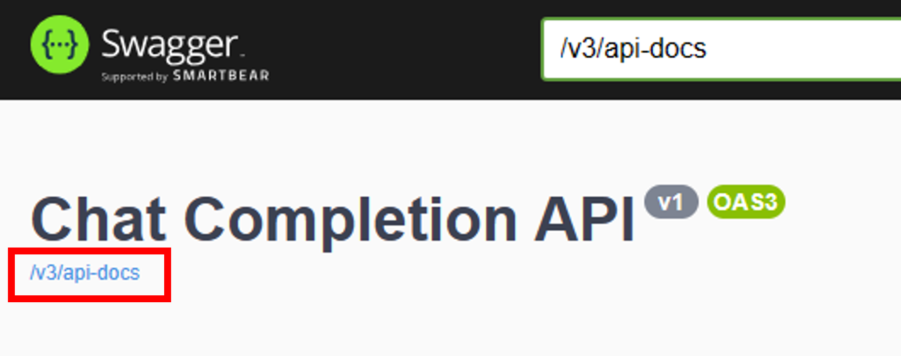

# API Management 수동 설정하기

## API Management 설정하기

API Management를 설정하기 위해서는 다시 Azure Portal로 돌아가야 합니다.

Azure Portal에서 APIM으로 접속해 `API` 탭에서 `Add API`를 누릅니다.

각 API 웹 앱에 접속해보면 Swagger UI의 OpenAPI 명세서를 확인할 수 있고, 타이틀 밑에 OpenAPI Specification 링크가 첨부되어 있습니다.



해당 링크를 그대로 복사해서 `OpenAPI Specification URL`에 붙여넣기 합니다.
그러면 자동으로 `Display name`과 `Name`이 채워집니다.

* API URL suffix
  * Issue API: `github`
  * Chat API: `aoai`
  * Storage API: `storage`

### GitHub Issues API(Issue API) Inbound policy 설정
```xml
<policies>
    <inbound>
        <base />
        <get-authorization-context provider-id="github-issues" authorization-id="github-issues" context-variable-name="auth-context" identity-type="managed" ignore-error="false" />
        <set-header name="x-github-token" exists-action="override">
            <value>@(((Authorization)context.Variables.GetValueOrDefault("auth-context"))?.AccessToken)</value>
        </set-header>
        <set-header name="User-Agent" exists-action="override">
            <value>API Management</value>
        </set-header>
    </inbound>
    <backend>
        <base />
    </backend>
    <outbound>
        <base />
    </outbound>
    <on-error>
        <base />
    </on-error>
</policies>
```
### Chat Completion API(Chat API) Inboud policy 설정
```xml
<policies>
    <inbound>
        <base />
        <set-header name="x-aoai-token" exists-action="override">
            <value>{{AOAI_TOKEN 값 넣기}}</value>
        </set-header>
    </inbound>
    <backend>
        <base />
    </backend>
    <outbound>
        <base />
    </outbound>
    <on-error>
        <base />
    </on-error>
</policies>
```

### GitHub Issues API(Storage API) policy 설정
설정할 내용 없음

### GitHubIssuesSummary 라는 새로운 API 만들기

Open API 명세서 파일 경로: `infra/openapi-bff.yaml`

`새로운 API 추가`에서 `Select a file`로 Open API 명세서 파일을 업로드합니다.

* API URL Suffix: `bff`
* Web service URL: `apim 엔드 포인트`

#### 각 API 엔드포인트에 inbound policy - `rewrite-uri` 추가하기
* ChatCompletions: `/aoai/chat/completions`
* IssueById: `/github/issues/{id}`
* Issues: `/github/issues`
* Storage: `/storage/issues`

### APIM GitHub OAuth 인증 설정하기
참고 링크: [GitHub OAuth 인증 설정하기](https://learn.microsoft.com/en-us/azure/api-management/authorizations-how-to-github)

* 프로필 > Settings > Developer settings > OAuth Apps 에서 새로운 OAuth App 생성

* GitHub에서 OAuth App 생성 시
  * Homepage URL: `https://{{.NET api 앱 이름}}.azurewebsites.net`
  * Callback URL: `https://authorization-manager.consent.azure-apim.net/redirect/apim/<YOUR-APIM-SERVICENAME>`
* Client secrets 생성 후 값 복사
* APIM의 보안 > 관리 ID > 상태 `켜기`
* APIM의 APIs > 권한 부여 
  * 공급자 이름: `github-issues`
  * ID 공급자: GitHub
  * Client ID: GitHub OAuth Client ID 값
  * Client secret: 복사 해 둔 Client secrets 값

* GitHub Login 
* 액세스 정책
  * API Management service `apim-hg{랜덤숫자}` 선택
  * 구성원 추가 선택

## 정적 웹 앱에서 APIM 연결하기
* `제품` 생성하기
  * 이름: Default Product
  * API 추가: 모든 API 추가
  * 게시됨 ✅, 구독/승인 선택 해제

[Visual Studio Code에서 원클릭 배포하기](./03-vscode.md) 👈 이전 | 다음 👉 [Bicep & Azure Developer CLI로 한 번에 프로비저닝하기](./05-bicep-azd-provision.md)
