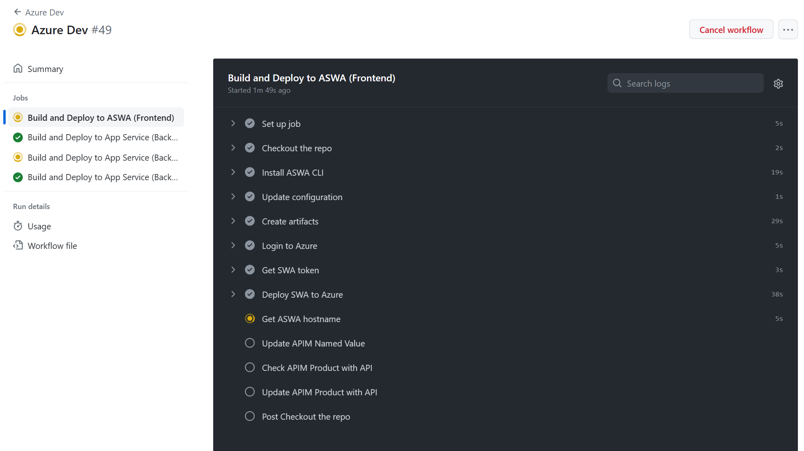

# GitHub Action으로 CI/CD 파이프라인 태우기

## Actions 탭에 가서 workflow 활성화 하기


## OpenAI 환경 변수 정의하기
포크 뜬 본인의 레포에서 `Settings` > `Secrets and variables` > `Actions` 선택


* GitHub Secret에 `AOAI_API_KEY` 추가
  * New repository secret로 NAME과 Secret값 입력

* GitHub Variable에 `AOAI_DEPLOYMENT_ID`와 `AOAI_API_ENDPOINT` 추가
  * Variables 탭으로 들어가서 동일하게 추가

## 파이프라인 정의 후 Azure Dev 워크플로우 실행하기
```powershell
# On Windows
$GITHUB_USERNAME = "{{자신의 GitHub ID}}"
```

```bash
# On Linux/MacOS
GITHUB_USERNAME="{{자신의 GitHub ID}}"
```

```bash
azd pipeline config
```

이떄 아래와 같이 commit & push 하겠냐는 질문에 `n`를 입력합니다.


```bash
gh auth login
gh workflow run "Azure Dev" --repo $GITHUB_USERNAME/workshop
```

> 만약 `.github/workflows/azure-dev.yml` 파일 이외에 [3단계](./03-vscode.md)에서 사용했던 다른 파일들이 있다면, 해당 파일들은 삭제하거나 파일 이름을 `*.yml.bak`으로 바꿉니다.

## 배포 확인하기
GitHub Actions에 새로운 workflow가 실행되고 있음을 확인할 수 있습니다.


각 스텝의 배포 상황을 보려면 해당 워크플로우를 선택하면 됩니다.
각 Job 및 Step의 로그를 확인할 수 있습니다.



## APIM 리소스 접속해서 GitHub Auth 설정하기
[Visual Studio Code에서 원클릭 배포하기](./03-vscode.md)에서 한 GitHub OAuth을 동일하게 반복합니다.

[Bicep & Azure Developer CLI로 한 번에 프로비저닝하기](./05-bicep-azd-provision.md) 👈 이전
